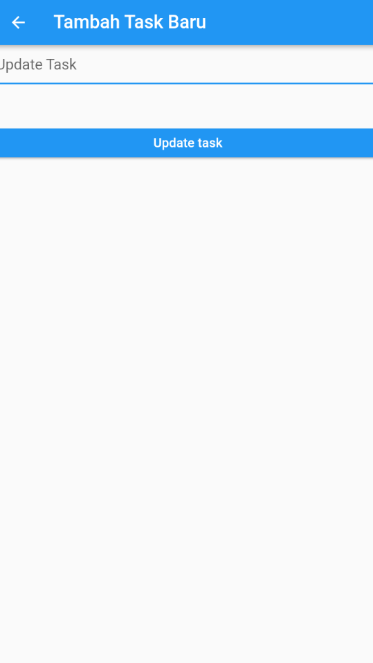

# Listview dengan Provider

* Nama =  Safira Istifarini
* Kelas = TI 3H
* NIm = 2041720229
* Absen = 17

Challenge untuk UTS Kerjakan salah satu saja 100 :

1. Tambahkan fitur untuk validasi input di tambah task.
* 

2. Tambahkan fitur untuk disable button tambah task jika validasi input masih error.
* 

3. Tambahkan fitur swipe left delete task
* 

4. Tambahkan fitur swipe right go to edit task page
* 

5. Tambahkan fitur edit task.
* 

6. Tambahkan fitur validasi input di edit task.
* 

7. Tambahkan fitur disable button edit task jika validasi input masih error.
* 

